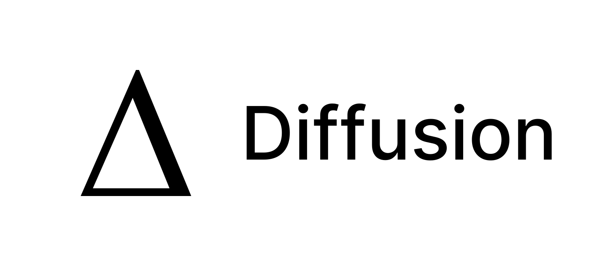

<h1>
<picture>
  <source media="(prefers-color-scheme: dark)" srcset="assets/logo_wide_dark.svg">
  <source media="(prefers-color-scheme: light)" srcset="assets/logo_wide_light.svg">
  
</picture>
</h1>

Android note app which integrate Git. You can use this app with other desktop editors.

## Why

Because all apps which integrate git on Android either separate the note title from the name of the file or use old UI/UX frameworks

# Features

- [x] open or clone repositories
- [x] notes search across the whole repository
- [x] folder navigation
- [x] edit view
- [x] private repo (SSH and HTTPS)
- [x] remote sync
- [x] time based sort

Notes are written to the repository while you type, so there is no save button.
Nothing is committed or sent anywhere until you tap the cloud button in the
search bar: that commits what has changed, pulls and pushes in one step. It is
the only thing that talks to the remote — there is no pull to refresh.

Opening a repository that is already on the device picks up its remote and its
author, so it is set up with what it already knows and only asks for the
credentials it cannot read. A repository without a remote is asked about rather
than left as it is, so notes written into it can still be synced later.

  

_Supported Android versions: 11 to 16_

_Supported Architecture: `arm64-v8a`, `x86_64`_

# Build

[See](./BUILD.md).

# Current limitation

- A repository has to live on the shared internal storage. A memory card or a usb stick has no file path git can be pointed at, and the app's own private directory is not offered because nothing else could reach the repository there.
- Android does not differentiate case for file name, so if you have a folder named `A` and another folder named `a`, `a` will not be displayed.
- Conflicts are resolved by hand, in the note. When the same note was changed here and on the remote, the sync stops and reports which notes it could not merge. Both versions are then in the note, between `<<<<<<<` and `>>>>>>>` markers: edit it down to what you want to keep and sync again, and that sync is what finishes the merge.

## Contributing

See [this file](./CONTRIBUTING.md).
